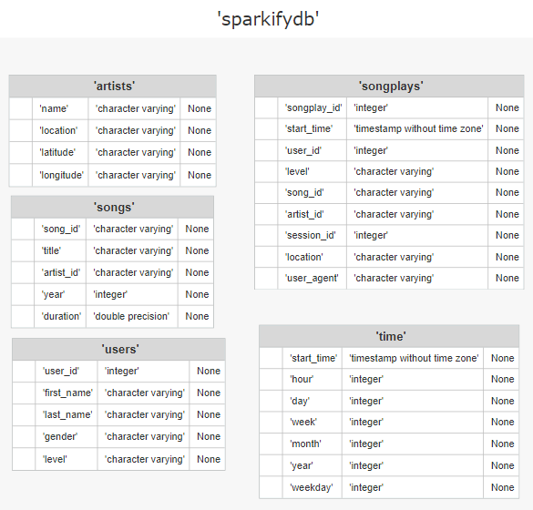

# Data Modeling with Postgres

A startup called Sparkify developed a music streaming app, which saves user activity in JSON-files and songs metadata in two local directories. Their analytics team wants to analyze these data. The aim of the project is to create an ETL pipeline for transferring data from JSON-files into a database with tables optimized for song play analysis.

The database schema is represented by the following diagram:

This project icludes 6 following files: 
1) **sql_queries.py** - contains all sql queries 
2) **create_tables.py** - drops and creates database sparkify and tables 
3) **etl.py** - reads and processes files from `song_data` and `log_data` and loads them into the tables 
4) **etl.ipynb** - notebook to read and processes a single file from `song_data` and `log_data` and loads the data into the tables 
5) **test.ipynb** - displays the first few rows of each table to check the database 
6) **README.md** - this file 

To run the project, execute the following command in Terminal:
`python3 create_table.py`
and
`python3 etl.py`