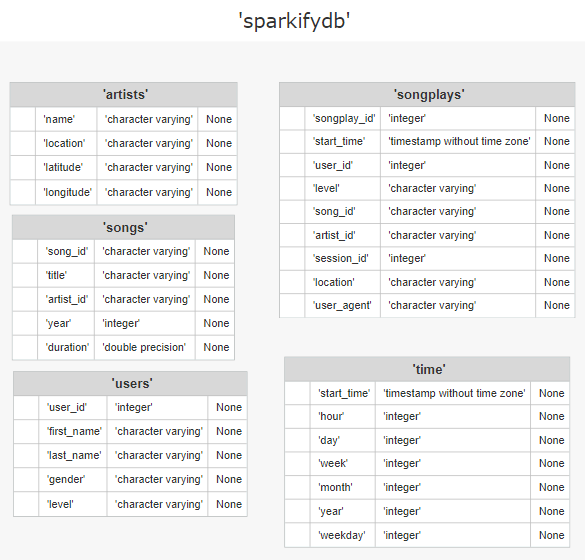

# Data Warehouse

## Introduction
A startup called Sparkify developed a music streaming app, which saves user activity in JSON-files and songs metadata in the cloud. Their analytics team wants to analyze these data.

The aim of the project is to create a data warehouse on AWS pulling data from JSON-files located on Amazon S3 into Amazon Redshift database with tables arranged in a star schema and optimized for song play analysis.

## Project Structure
The database schema consists of the fact table  `songplays`  and the dimension tables:  `artists`  `songs`  `time`  `users`  The database structure is represented by the following diagram:

This project icludes 5 following files: 
1) **dwh.cfg** - configuration file 
2) **sql_queries.py** - contains all sql queries 
3) **create_tables.py** - drops and creates tables in the Amazon Redshift 
4) **etl.py** - reads files from from Amazon S3 to the staging tables and loads processed data into analytical tables of Amazon Redshift database 
5) **README.md** - this file 

## Run Project
To run the project, modify the configuration file `dwh.cfg` and then execute the following command in Terminal: 
`python3 create_table.py` 
and 
`python3 etl.py`
