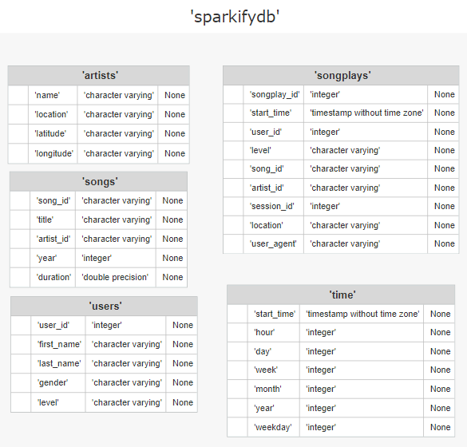

# Airflow Data Pipeline

## Introduction
A startup called Sparkify developed a music streaming app, which saves user activity in JSON-files and songs metadata in the cloud. Their analytics team wants to analyze these data.

The aim of the project is to build an Apache Airflow pipeline that creates a data warehouse on AWS pulling data from JSON-files located on Amazon S3 into Amazon Redshift database with tables arranged in a star schema and optimized for song play analysis.

## Project Structure
This project icludes 7 following files: 
1) **dags/udac_example_dag.py** - DAG file 
2) **create_tables.sql** - SQL queries for the creation of required tables 
3) **plugins/operators/stage_redshift.py** - definition of **StageToRedshiftOperator** to copy data from JSON files located in Amazon S3 to staging tables in Amazon Redshift data warehouse
4) **plugins/operators/load_fact.py** - definition of **LoadFactOperator** to load data from staging tables to fact table
5) **plugins/operators/load_dimension.py** - definition of **LoadDimensionOperator** to load data from staging tables to dimension tables
6) **plugins/operators/data_quality.py** - definition of **DataQualityOperator** to check data quality
7) **plugins/helpers/sql_queries.py** - SQL queries to insert data into the tables 
8) **README.md** - this file 

## Analytics Schema
The analytics schema is a star schema optimized for queries on song play analysis. It consists of the fact table  `songplays`  and the dimension tables:  `artists`  `songs`  `time`  `users`  The structure is represented by the following diagram: 

## Run Project
To run the project, put `aws_credentials` and `redshift` connection in the Airflow 
and 
execute **udac_example_dag from** the Airflow.